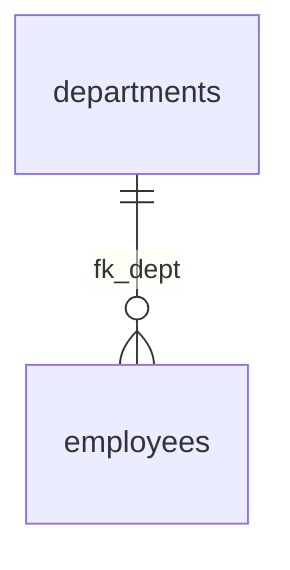

# CreateSQLFromDDL
外部キー設定DDLからSQLの結合部分を自動生成したい

# 外部ライブラリ
pip install -r requirements.txt


以下は、今回のPythonスクリプト（`parse_fk.py`）の使い方や起動方法をまとめた `README.md` のテンプレートです。
このままプロジェクトディレクトリに `README.md` として保存して使用できます。

---

## 📘 README.md

````markdown
# 🔗 外部キー依存からJOIN文・ER図を自動生成するツール

このツールは、PostgreSQLの `ALTER TABLE` 形式で記述された外部キー制約DDLから以下の情報を自動生成します：

- 外部キーの依存関係（親→子）
- INSERT / DELETE 順序
- Mermaid形式のER図
- 指定テーブルを起点とした INNER JOIN クエリ（テーブル別名付き）

---

## 📁 DDLファイルの前提

- DDLファイルはすべて1つのフォルダ（例：`ddl_files/`）に格納
- 各ファイルには1つ以上の `ALTER TABLE` が記載されている想定
- フォーマット例：

```sql
ALTER TABLE employees
ADD CONSTRAINT fk_dept FOREIGN KEY (dept_id)
REFERENCES departments(dept_id);
````

---

## 🧰 セットアップ

### 1. Python仮想環境の作成（任意）

```bash
python -m venv venv
source venv/bin/activate     # Windowsの場合: venv\Scripts\activate
```

### 2. 依存ライブラリのインストール

```bash
pip install -r requirements.txt
```

### requirements.txt

```
networkx>=3.0
```

---

## 🚀 実行方法

### 1. スクリプト編集（`parse_fk.py`）

* `DDL_DIR` にDDLファイル格納ディレクトリを指定（例：`ddl_files`）
* `start_table` にJOINの起点となるテーブル名を指定

```python
DDL_DIR = "ddl_files"
start_table = "employees"  # ← 例：JOINの起点となるテーブル名
```

### 2. 実行

```bash
python parse_fk.py
```

---

## 🧾 出力内容

### ✅ INSERT順序（親 → 子）

外部キー依存を考慮した挿入順序

### ✅ DELETE順序（子 → 親）

削除時の参照制約エラーを回避する削除順序

### ✅ Mermaid形式ER図

Mermaid記法でのテーブル関連表示（例）：



### ✅ INNER JOINクエリ（別名付き）

指定テーブルから外部キーをたどって自動生成されるJOIN文（INNER JOIN）。
エイリアス命名ルール：

* `aa_bb_cc` → `abc`
* 重複する場合 → `abc1`, `abc2` …

例：

```sql
SELECT *
FROM employees emp
INNER JOIN departments d ON emp.dept_id = d.dept_id
INNER JOIN payrolls p ON p.emp_id = emp.emp_id;
```

---

## 📌 注意事項

* 自己参照外部キーや循環参照がある場合は対応していません
* `CREATE TABLE` 文は不要です（`ALTER TABLE` のみでOK）

---
